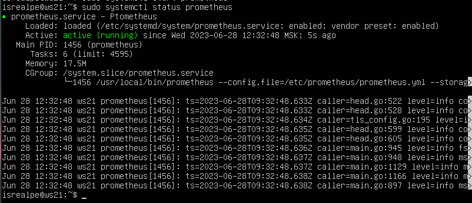
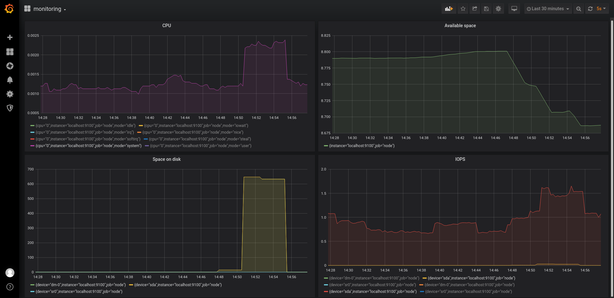

##### Установка Prometheus, Grafana

`$ sudo apt install prometheus`

`$ sudo snap install grafana`

##### Запуск и проверка
`$ sudo systemctl enable prometheus`
`$ sudo systemctl start prometheus`
`$ sudo systemctl status prometheus`



`$ sudo systemctl enable grafana-server`

`$ sudo systemctl start grafana-server`

`$ sudo systemctl status grafana-server`


*Чтобы получить доступ к веб интерфейсу Grafana и Prometheus с локальной машины, понадобилось пробросить порт в вижуал бокс*


##### Создание статической цели Node Exporter

`$ sudo vim /etc/prometheus/prometheus.yml`

```
- job_name: "node_export"
    static_configs:
      - targets: ["localhost:9100"]
```


##### До выполнения скрипта из второй части


##### После выполнения скрипта из второй части



##### Выполнение команды stress

`$ stress -c 2 -i 1 -m 1 --vm-bytes 32M -t 10s`


*****